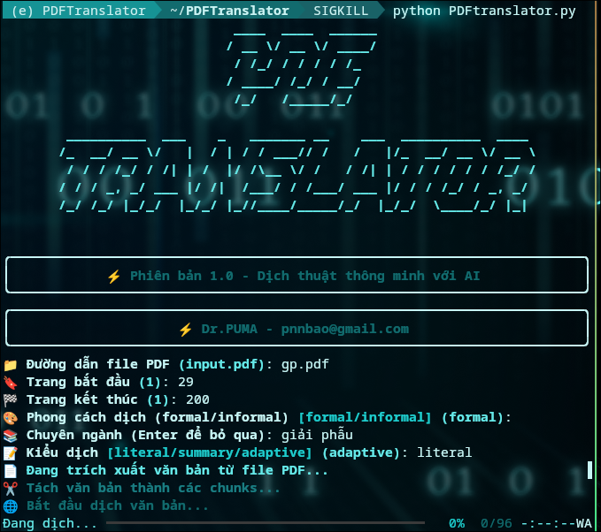

# PDF Translator

**PDF Translator** là một công cụ dịch thuật thông minh sử dụng AI để dịch văn bản từ file PDF tiếng Anh sang tiếng Việt. Chương trình hỗ trợ nhiều phong cách dịch (trang trọng/thân mật), kiểu dịch (sát nghĩa, tóm tắt, linh hoạt), và lưu trữ kết quả dịch để tiếp tục nếu bị gián đoạn. Giao diện thân thiện với thanh tiến độ và thông báo màu sắc giúp trải nghiệm mượt mà.

- **Phiên bản**: 1.0
- **Tác giả**: Phạm Nguyễn Ngọc Bảo
- **Email**: [pnnbao@gmail.com](mailto:pnnbao@gmail.com)

---

## Tính năng

- **Dịch thuật thông minh**: Dịch văn bản từ PDF tiếng Anh sang tiếng Việt với các phong cách (formal/informal) và kiểu dịch (literal/summary/adaptive).
- **Hỗ trợ chuyên ngành**: Cho phép giữ nguyên thuật ngữ chuyên môn và thêm chú thích tiếng Việt.
- **Bảo vệ mã nguồn**: Giữ nguyên các đoạn code trong văn bản, không dịch và định dạng bằng Markdown.
- **Xử lý bất đồng bộ**: Dịch nhiều đoạn văn bản đồng thời với giới hạn tải API, đảm bảo hiệu suất cao.
- **Lưu trữ kết quả**: Sử dụng cơ sở dữ liệu SQLite để lưu các đoạn đã dịch, hỗ trợ tiếp tục nếu bị gián đoạn.
- **Giao diện đẹp mắt**: Sử dụng thư viện `rich` để hiển thị giao diện với thanh tiến độ, bảng thông báo, và màu sắc sinh động.
- **Cấu hình linh hoạt**: Người dùng có thể chỉnh sửa API key, URL, và mô hình AI thông qua file `config.yaml` mà không cần sửa mã nguồn.

---

## Yêu cầu hệ thống

- **Hệ điều hành**: Windows, macOS, hoặc Linux.
- **Python**: Phiên bản 3.8 trở lên.
- **Thư viện Python**:
  - `pdfplumber`
  - `semantic-kernel`
  - `openai`
  - `pyfiglet`
  - `rich`
  - `pyyaml`
  - `asyncio`
  - `sqlite3` (có sẵn trong Python)

Cài đặt các thư viện cần thiết bằng lệnh:

```bash
pip install -r requirements.txt
```

> API Key: Cần có API key từ OpenRouter để sử dụng dịch vụ AI. Đăng ký tại OpenRouter.

## Cài đặt và cấu hình

- **Clone mã nguồn từ GitHub**:
     ```bash
     git clone https://github.com/pnnbao97/PDFTranslator
     cd PDFTranslator
     python -m venv venv
     source venv/bin/activate
     pip install -r requirements.txt

- **Cấu trúc thư mục mẫu**:
```
    pdf_translator/
    ├── PDFtranslator.py
    ├── config.yaml
    ├── translations.db (tạo tự động khi chạy)
    ├── translated.md (kết quả đầu ra)
    └── input.pdf (file PDF đầu vào)
```
- **Cấu hình file config.yaml**:

    Mở file config.yaml trong thư mục dự án.
    Cập nhật các thông tin sau:
    yaml

        openrouter:
          api_key: "your_openrouter_api_key_here"  # Thay bằng API key của bạn
          base_url: "https://openrouter.ai/api/v1"  # URL API của OpenRouter
          ai_model_id: "openrouter/optimus-alpha"  # Mô hình AI (có thể thay đổi)
    > Lưu ý:
            Thay your_openrouter_api_key_here bằng API key thực tế từ OpenRouter.
            Không chia sẻ file config.yaml công khai để bảo vệ API key.
            Nếu muốn dùng mô hình AI khác, cập nhật ai_model_id theo danh sách mô hình hỗ trợ của OpenRouter.
    Chuẩn bị file PDF:
        Đặt file PDF cần dịch (ví dụ: input.pdf) trong thư mục dự án hoặc bất kỳ vị trí nào trên máy tính.
        Đảm bảo file PDF chứa văn bản có thể trích xuất (không phải ảnh scan).

## Cách sử dụng

- **Chạy chương trình**:
        Mở terminal hoặc command prompt.
        Điều hướng đến thư mục dự án:
        bash
```
cd path/to/pdf_translator
python PDFtranslator.py
```
- **Nhập thông tin**: Chương trình sẽ hiển thị giao diện tương tác với các yêu cầu sau:
        Đường dẫn file PDF: Nhập đường dẫn đến file PDF (mặc định: input.pdf).
        Trang bắt đầu: Số trang bắt đầu dịch (mặc định: 1).
        Trang kết thúc: Số trang kết thúc dịch (mặc định: 1).
        Phong cách dịch:
            formal: Trang trọng, học thuật.
            informal: Thân mật, tự nhiên.
        Chuyên ngành: Nhập tên chuyên ngành (ví dụ: y học, công nghệ) hoặc nhấn Enter để bỏ qua.
        Kiểu dịch:
            literal: Dịch sát nghĩa từng từ.
            summary: Dịch tóm tắt, ngắn gọn.
            adaptive: Dịch linh hoạt theo ngữ cảnh.
- **Theo dõi tiến độ**:
        Chương trình sẽ trích xuất văn bản, tách thành các đoạn (chunks), và dịch từng đoạn.
        Thanh tiến độ hiển thị trạng thái dịch với số lượng chunk đã hoàn thành và thời gian còn lại.
    Kết quả:
        Bản dịch được lưu vào file translated.md trong thư mục dự án.
        Các đoạn đã dịch được lưu trữ trong translations.db để hỗ trợ tiếp tục nếu bị gián đoạn.

Ví dụ

Đầu vào:

    File PDF: input.pdf (chứa tài liệu tiếng Anh về công nghệ).
    Nhập:
        Đường dẫn: input.pdf
        Trang: 1-3
        Phong cách: formal
        Chuyên ngành: công nghệ
        Kiểu dịch: adaptive

Đầu ra:

    File translated.md chứa văn bản dịch sang tiếng Việt theo phong cách trang trọng, giữ nguyên thuật ngữ công nghệ với chú thích.
    Cơ sở dữ liệu translations.db lưu từng đoạn dịch để sử dụng lại.

## Xử lý sự cố

- **Lỗi "File cấu hình không tồn tại"**:
        Kiểm tra xem file config.yaml có trong thư mục dự án không.
        Nếu không, tạo file mới với nội dung mẫu như ở phần Cấu hình.
- **Lỗi "API key không hợp lệ"**:
        Xác minh API key trong config.yaml đúng với key từ OpenRouter.
        Kiểm tra kết nối mạng.
- **Lỗi "File PDF không tồn tại"**:
        Đảm bảo đường dẫn file PDF chính xác.
        Kiểm tra file PDF có chứa văn bản (không phải ảnh).
- **Dịch chậm hoặc lỗi API**:
        Chương trình tự động thử lại tối đa 3 lần nếu API gặp lỗi.
        Nếu vẫn thất bại, kiểm tra hạn mức API trên OpenRouter hoặc thử lại sau.
- **Không trích xuất được văn bản**:
        File PDF có thể là ảnh scan. Sử dụng công cụ OCR (như Tesseract) để chuyển thành văn bản trước.

## Tiếp tục dịch dang dở

Nếu chương trình bị gián đoạn, bạn có thể chạy lại mà không mất dữ liệu:

    Các đoạn văn bản đã dịch được lưu trong translations.db.
    Khi chạy lại, chương trình sẽ kiểm tra và chỉ dịch các đoạn chưa hoàn thành (yêu cầu giữ nguyên file PDF gốc).

## Góp ý và hỗ trợ

Nếu bạn có ý tưởng cải tiến hoặc gặp vấn đề, hãy liên hệ:

    Tác giả: Phạm Nguyễn Ngọc Bảo
    Email: pnnbao@gmail.com

Vui lòng gửi email với mô tả chi tiết về vấn đề hoặc đề xuất của bạn.
## Giấy phép

Dự án này được phát hành dưới dạng mã nguồn mở. Bạn có thể sử dụng, chỉnh sửa và phân phối theo nhu cầu, nhưng vui lòng ghi nhận tác giả gốc (Phạm Nguyễn Ngọc Bảo).
>Lời cảm ơn

>Cảm ơn bạn đã sử dụng PDF Translator! Hy vọng công cụ này sẽ hỗ trợ bạn trong việc dịch thuật nhanh chóng và hiệu quả.
Ghi chú cho nhà phát triển

>Nếu bạn muốn đóng góp vào mã nguồn:

    Fork dự án và gửi pull request.
    Đảm bảo mã tuân theo chuẩn PEP 8.
    Thêm docstring cho các hàm mới.
    Kiểm tra tính tương thích với Python 3.8+.
